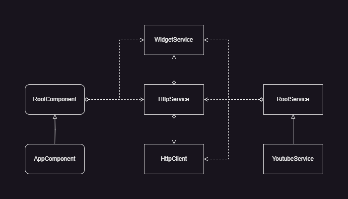
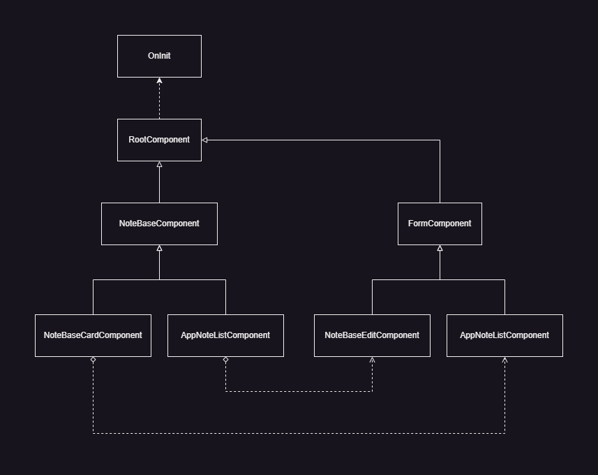

# Mochi APP

+ Youtube 縮圖擷取工具，使用 Youtube API 串接
+ 記事本功能可上傳圖片、寫入日期和標籤功能，包含新增、刪除和修改

## 檔案架構

```
🏠 app.sweetmochi.tw
├── 📁 app
│   ├── app.component.ts 路由事件與側欄功能
│   ├── app.config.ts Interceptor 設定
│   ├── app.const.ts 全域服務設定
│   ├── app.routes.ts 路由設定
│   ├── app.type.ts 側欄型別
│   ├── 📁 base
│   │   ├── form.component.ts 表單基礎功能
│   │   └── 📁 youtube
│   │       ├── youtube-validator.service.ts Youtube 非同步驗證方法
│   │       ├── youtube.const.ts Youtube 網址設定參數
│   │       ├── youtube.service.ts Youtube 通用方法與暫存影片資料
│   │       └── youtube.type.ts Youtube 縮圖資料型別與錯誤型別
│   │
│   └── 📁 page
│       ├── 📁 note
│       │   ├── note-list 筆記本列表
│       │   ├── note-page 筆記本內頁
│       │   └── 📁 _base
│       │       ├── note-base-card 筆記本卡牌區塊
│       │       ├── note-base-edit 筆記本編輯區塊
│       │       ├── note-base.component.ts 筆記本通用方法
│       │       └── note-base.type.ts 筆記本資料型別
│       │
│       ├── setting 設定頁面
│       └── youtube-thumbnail Youtube 縮圖擷取工具
│
├── 📁 root
│   ├── 📁 const
│   │   ├── api-list.const.ts 所有接口列表
│   │   ├── api-status.const.ts API 回覆狀態列表
│   │   ├── config.const.ts 全站設定
│   │   └── root.const.ts 不需要調整的常用變數
│   │
│   ├── 📁 interceptor
│   │   ├── api.interceptor.ts 接口測試攔截器
│   │   └── note.interceptor.ts 筆記本資料攔截器
│   │
│   ├── 📁 method
│   │   ├── api-status.ts API 狀態建立方法
│   │   ├── local.ts 本地儲存相關方法
│   │   ├── root.ts 通用方法
│   │   └── validator.ts 驗證方法
│   │
│   ├── root.component.ts 底層通用繼承
│   ├── root.module.ts 底層通用匯入
│   ├── root.service.ts 底層通用服務
│   ├── 📁 service
│   │   ├── http.service.ts HTTP 資料交換服務
│   │   └── widget.service.ts 元件互動服務
│   │
│   ├── 📁 type
│   │   ├── api.type.ts API 回傳型別
│   │   ├── error.type.ts 錯誤型別
│   │   └── local.type.ts 本地儲存型別
│   │
│   └── 📁 widget
│       └── popup-confirm 跳窗元件
│
├── index.html 網頁進入點
├── main.ts 系統進入點
└── styles.less 樣式表
```

## 底層配置



### 概要
+ `HttpService` 需要 `WidgetService` 來顯示連線錯誤提醒
+ `HttpService` 封裝 `HttpClient` 後端回傳的資料格式
+ `RootService` 調用 `HttpClient` 寫入其他接口的互動方法
+ `AppComponent` 或其他元件繼承 `RootComponent` 所有功能
+ `YoutubeService` 或其他服務繼承 `RootService` 所有功能

## 功能邏輯



### 概要
+ `RootComponent` 實作 `angular init`，並且加入通用 service，使繼承的功能可以使用 super 調用 RootComponent 定義的方法
+ `FormComponent` 以 `RootComponent` 為基礎，增加 `FormBuilder` 的功能
+ `NoteBaseComponent` 作為記事本功能的抽象繼承，除了 `RootComponent` 功能也額外增加筆記本路由方法

### 元件設計
+ `NoteBaseCard` 為筆記卡牌顯示元件，提供筆記本列表顯示卡牌效果，有繼承 `NoteBaseComponent` 跳轉頁面功能
+ `NoteBaseEdit` 是筆記編輯或新增卡牌的元件，繼承 `FormComponent` 表單驗證的功能

### 頁面功能
+ `AppNoteList` 做為筆記本列表頁面，繼承 `NoteBaseComponent` 跳轉頁面方法，並且擁有 `NoteBaseCardComponent` 用來顯示卡牌資料
+ `AppNotePage` 是單獨的筆記本頁面，可以編輯指定的記事本資料，或是新增全新的筆記，同樣繼承 `NoteBaseComponent` 頁面跳轉的方法，並且擁有 `NoteBaseEditComponent` 可以用來編輯或新增卡牌資料

